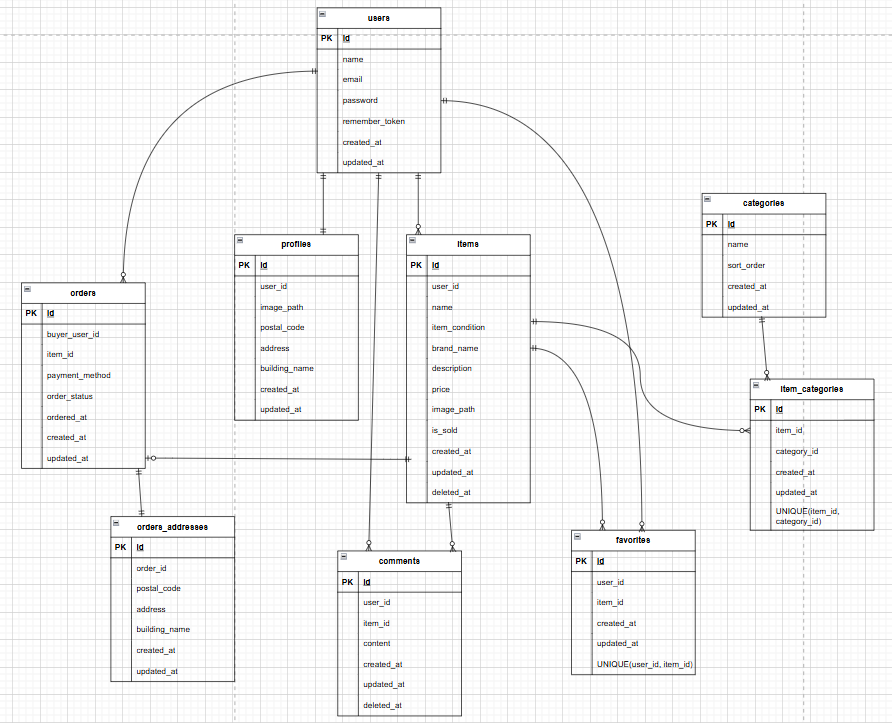

# laravel-docker-template
# flea-market

## 環境構築

### Dockerビルド
```
1.git@github.com:nagi0119/flea-market.git
```
2.DockerDesktopアプリを立ち上げる
```
3.docker-compose up -d --build
```
mysql:
・Nginx：nginx:1.21.1
・MySQL：mysql:8.0.26
・phpMyAdmin：phpmyadmin/phpmyadmin

### Laravel環境構築
```
1.docker-compose exec php bash
2.composer install
```
3.「.env.example」ファイルを 「.env」ファイルに命名を変更。または、新しく.envファイルを作成
4..envに以下の環境変数を追加

```
DB_HOST=mysql
DB_DATABASE=laravel_db
DB_USERNAME=laravel_user
DB_PASSWORD=laravel_pass
```
5.アプリケーションキーの作成
```
php artisan key:generate
```
6.マイグレーションの実行
```
php artisan migrate
```
7.シーディングの実行
```
php artisan db:seed
```

## 使用技術（実行環境）
- PHP 8.1.34
- Laravel 8.83.8
- MySQL 8.0.26

### 開発環境
- 環境開発：http://localhost/products
- phpMyAdmin：http://localhost:8080/
---

## ER図

---

## 画像保存
