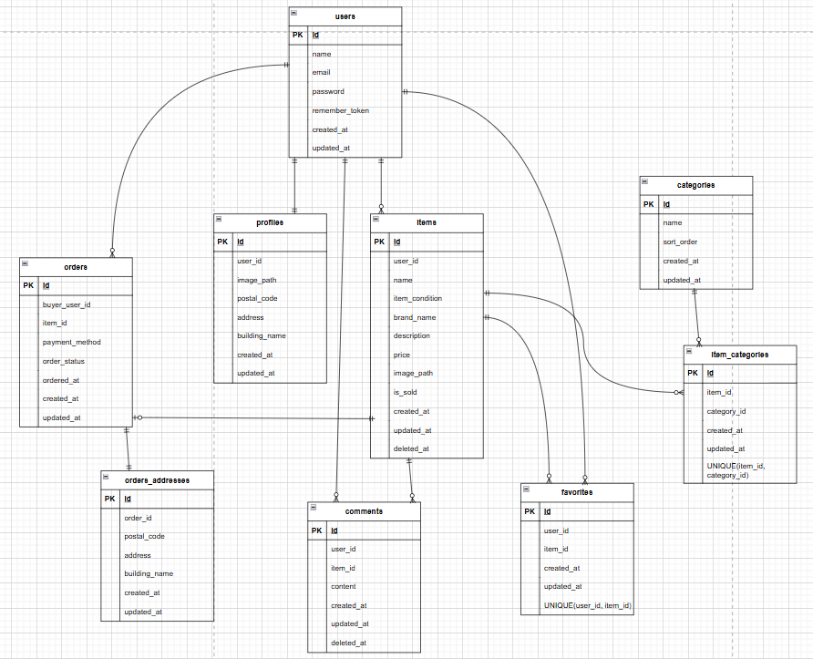

# flea-market

フリマアプリを模したECサイトです。

会員登録、ログイン、商品出品、商品購入、いいね、コメント、プロフィール編集、メール認証、Stripe決済機能を実装しています。

## 環境構築

### 事前準備

- Git をインストールしてください。
- Docker Desktop をインストールしてください。

Docker Desktop がインストールされていない場合は、公式サイトからインストールしてください。

公式サイト: https://www.docker.com/ja-jp/get-started/

### Dockerビルド

1. リポジトリをクローンしてください。

```bash
git clone git@github.com:nagi0119/flea-market.git
```
```bash
cd flea-market
``` 
2. Docker Desktopアプリを立ち上げてください。

Docker Desktop を起動し、正常に立ち上がっていることを確認してください。

3. コンテナを起動
```bash
docker-compose up -d --build
```
### Permission denied エラーが発生する場合

- 以下のようなエラーが表示された場合

The stream or file "/var/www/storage/logs/laravel.log"
could not be opened in append mode:
Failed to open stream: Permission denied

ディレクトリ権限を変更してください。

```bash
sudo chmod -R 777 src/*
```

その後、再度コンテナを起動してください。

```bash
docker-compose up -d
```


### 使用コンテナ

- Nginx: nginx:1.21.1
- MySQL: mysql:8.0.26
- phpMyAdmin: phpmyadmin/phpmyadmin

### Laravel環境構築

1. PHPコンテナに入ってください。
```bash
docker-compose exec php bash
```
2. composerをインストールしてください。
```bash
composer install
```
3. .env.example をコピーして .env を作成してください。
```bash
cp .env.example .env
```
4. .envに以下の環境変数を追加してください。

```env
DB_CONNECTION=mysql
DB_HOST=mysql
DB_PORT=3306
DB_DATABASE=laravel_db
DB_USERNAME=laravel_user
DB_PASSWORD=laravel_pass
```
```env
MAIL_MAILER=smtp
MAIL_HOST=mailhog
MAIL_PORT=1025
MAIL_USERNAME=null
MAIL_PASSWORD=null
MAIL_ENCRYPTION=null
MAIL_FROM_ADDRESS=test@example.com
MAIL_FROM_NAME="${APP_NAME}"
```
```env
STRIPE_KEY=your_stripe_key
STRIPE_SECRET=your_stripe_secret
```

5. アプリケーションキーの作成をしてください。
```bash
php artisan key:generate
```
6. マイグレーションの実行してください。
```bash
php artisan migrate
```
7. シーディングの実行してください。
```bash
php artisan db:seed
```
8. シンボリックリンク作成してください。
```bash
php artisan storage:link
```

## 使用技術（実行環境）
- PHP 8.1.34
- Laravel 8.83.8
- MySQL 8.0.26
- Docker
- Fortify
- Stripe

## URL

- 開発環境: http://localhost
- phpMyAdmin: http://localhost:8080/
- MailHog: http://localhost:8025

---

## ER図


---

## 実装機能
- 会員登録
- ログイン
- ログアウト
- メール認証
- 商品一覧
- 商品検索
- 商品詳細
- いいね機能
- コメント機能
- 商品購入
- Stripe決済
- 配送先変更
- プロフィール編集
- 商品出品

## ダミーデータ

### ユーザー1

メールアドレス / パスワード
```text
aaa@example.com / 11111111
```

### ユーザー2

メールアドレス / パスワード
```text
bbb@example.com / 11111111
```

### ユーザー3

メールアドレス / パスワード
```text
ccc@example.com / 11111111
```

### ユーザー4

メールアドレス / パスワード
```text
ddd@example.com / 11111111
```

## テスト

テスト実行前に、MySQLコンテナ内でテスト用データベースを作成してください。
以下のコマンドを実行してください。

```bash
docker-compose exec mysql bash
```
```bash
mysql -u root -p
```

MySQLにログイン後、以下を実行してください。
```sql
CREATE DATABASE demo_test;
```

作成できたらMySQLから抜けてください。
```bash
exit
```

コンテナからも抜けてください。
```bash
exit
```

.envをコピーして.env.testing を作成してください。
```bash
cp .env .env.testing
```
.env.testing を以下のように変更してください。

```env
APP_NAME=Laravel
APP_ENV=test
APP_KEY=
APP_DEBUG=true
APP_URL=http://localhost
```
```env
DB_CONNECTION=mysql_test
DB_HOST=mysql
DB_PORT=3306
DB_DATABASE=demo_test
DB_USERNAME=root
DB_PASSWORD=root
```

設定後、テスト用のアプリケーションキーを作成します。
PHPコンテナに入ってください。

```bash
docker-compose exec php bash
```
```bash
php artisan key:generate --env=testing
```
```bash
php artisan config:clear
```
```bash
php artisan migrate --env=testing
```
Unitテスト用のディレクトリを作成してください。
```bash
mkdir -p tests/Unit
```
テストを実行してください。
```bash
php artisan test
```

実行結果
- 40 tests passed

## メール認証

MailHogを使用

認証メール確認URL

http://localhost:8025

## 決済

Stripe Checkoutを利用した決済機能を実装しています。

Stripeのテストキーを取得し、
.env のyour_stripe_key、your_stripe_secret部分に入力して設定してください。

```env
STRIPE_KEY=your_stripe_key
STRIPE_SECRET=your_stripe_secret
```
### Stripe決済テスト

カード支払いをテストする場合は、Stripeのテストカードを使用してください。

カード番号
```text
4242 4242 4242 4242
```

有効期限
```text
12/34
```

CVC
```text
123
```

郵便番号
```text
12345
```

## 補足

以下の実装については課題要件には記載がありませんでしたが、コーチに確認の上で実装しています。

- 初回ログイン時のプロフィール設定画面のバリデーションエラーメッセージは「○○は必須です」と表示
- 自分が出品した商品の詳細画面では購入ボタンを非表示
- 購入済み商品の詳細画面では購入ボタンを非表示
- エラーメッセージの文字色は赤色で表示
- ダミー商品のカテゴリは任意のカテゴリを設定
